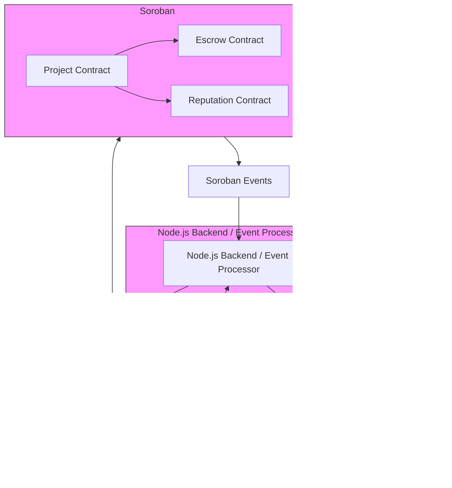

# Planned Architecture

```mermaid
flowchart TB
    subgraph UserLayer[User]
        U[User]
    end

    subgraph Frontend[React Frontend]
        FE[React Frontend]
    end

    subgraph Backend[Node.js Backend / Event Processor]
        BE[Node.js Backend / Event Processor]
    end

    subgraph Stellar[Stellar RPC]
        SR[Stellar RPC]
    end

    subgraph Soroban[Soroban]
        PC[Project Contract]
        EC[Escrow Contract]
        RC[Reputation Contract]
    end

    U --> FE
    FE --> BE
    BE --> SR
    SR --> Soroban

    PC --> EC
    PC --> RC

    Soroban --> SE[Soroban Events]
    SE --> BE
    BE --> DB[PostgreSQL]
    DB --> FE

    classDef label fill:#f9f,stroke:#333,stroke-width:1px;
    class Soroban,Stellar,Backend,Frontend,UserLayer label;
```